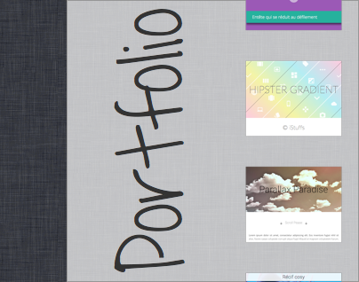
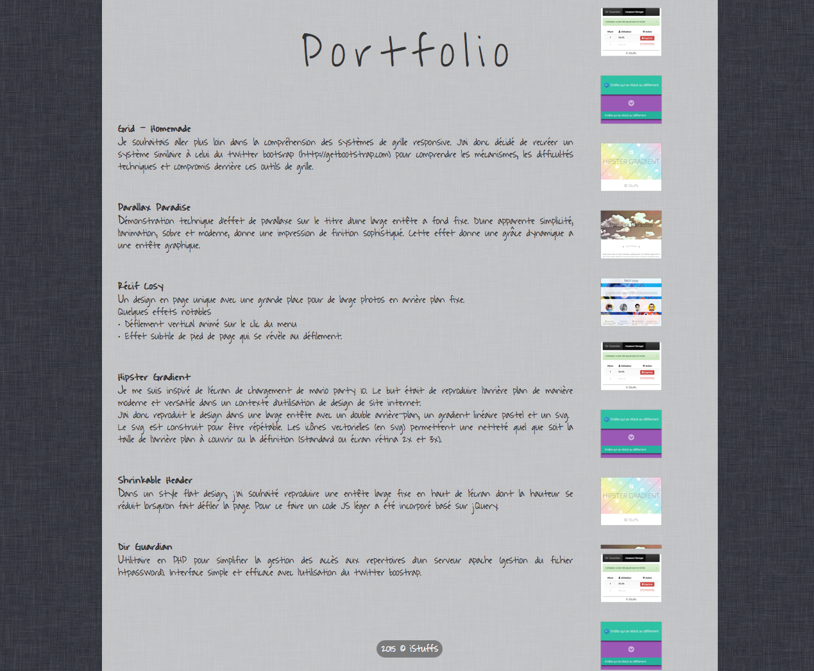

# Portfolio - Strip background

Un thème de portfolio avec un arrière-plan en forme de bandelette de prévisualisation des créations. Un effet de parallaxe fait défilé les vignettes des réalisations.

## Thème

**Mine Shaft**: #333
Arrière plan foncé avec texture tissée.
Fond blanc translucide pour laisser apparaitre la texture de l'arrière plan et contraster avec la police gris foncé.

## Police

**Waiting for the Sunrise** | [https://www.google.com/fonts/specimen/Waiting+for+the+Sunrise](https://www.google.com/fonts/specimen/Waiting+for+the+Sunrise)
J'ai choisi une police de caractère manuscrite pour donner une impression d'esquisse et de projet en cours de réalisation. Cela donne aussi un caractère plus personnel au portfolio. La police Waiting for the Sunrise reste très lisible même sur terminaux mobil.

## En savoir plus

**Behance**: [https://www.behance.net/gallery/28744885/Portfolio-Strip-background](https://www.behance.net/gallery/28744885/Portfolio-Strip-background)
**Live demo**: [http://istuffs.github.io/grid-homemade/](http://istuffs.github.io/grid-homemade/)

---
©iStuffs